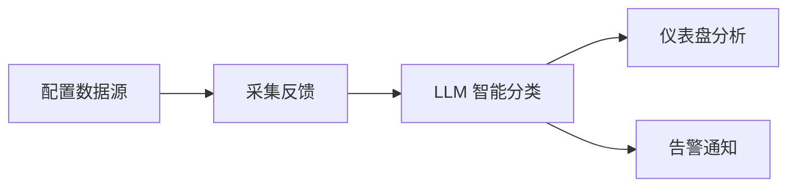
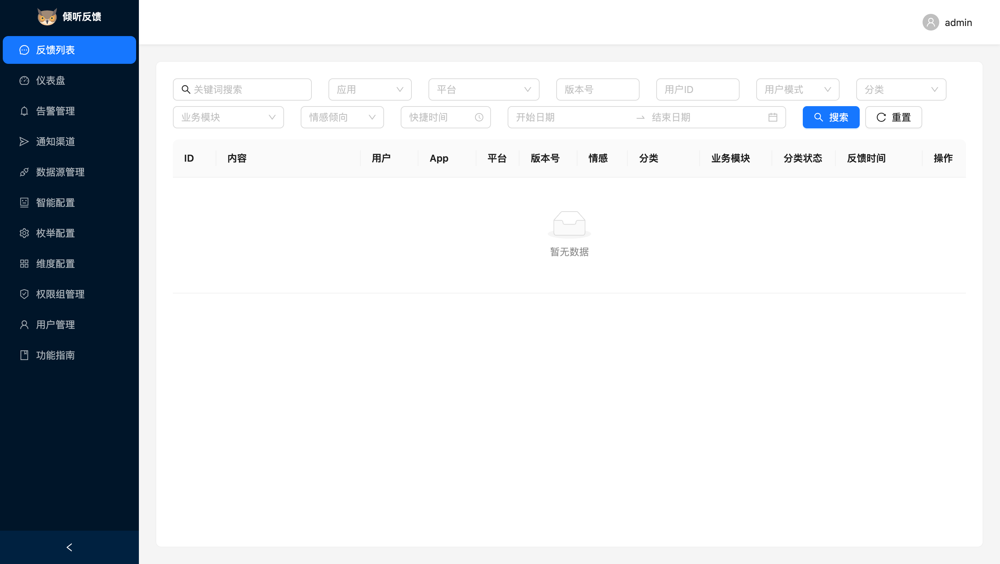
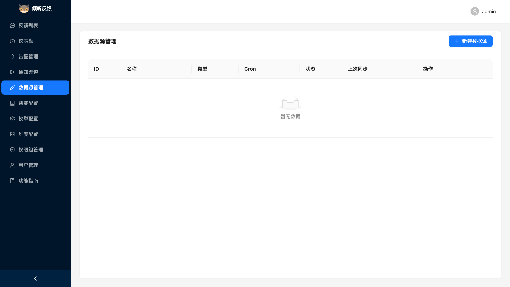
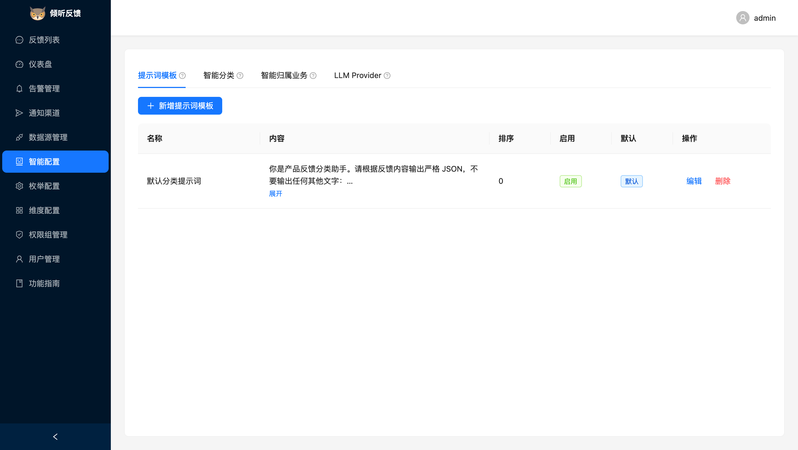
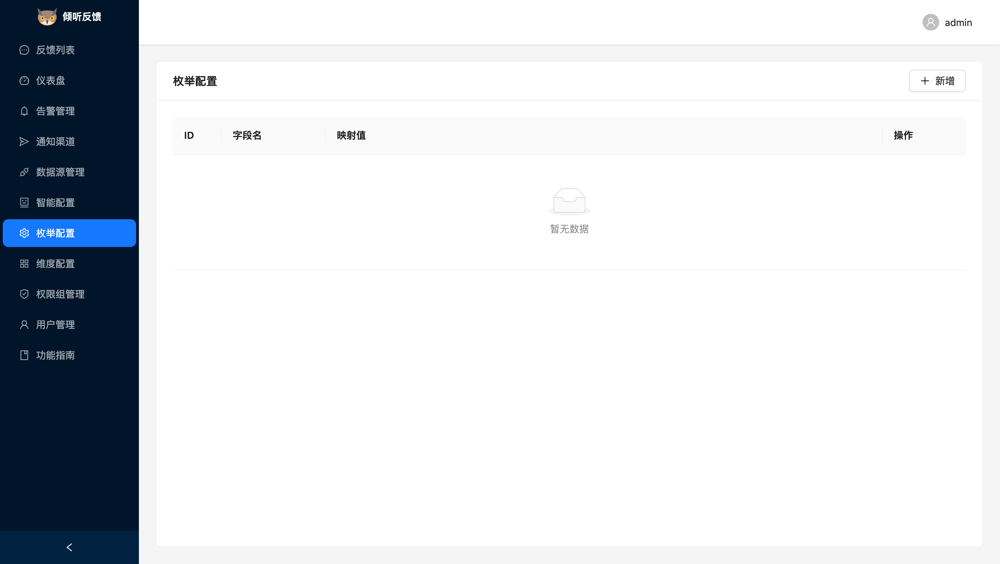
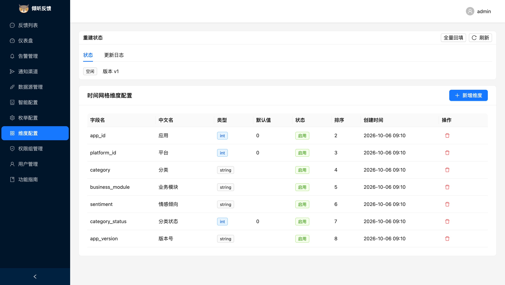
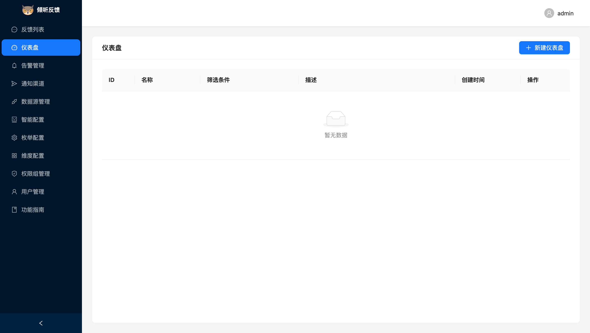
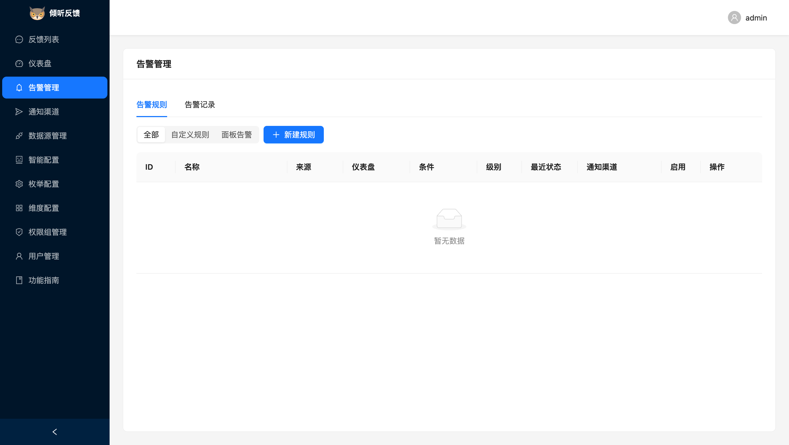
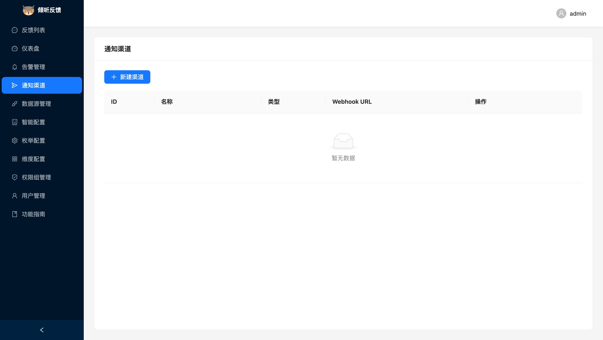

# 使用教程

本教程帮助你快速了解「倾听用户反馈」的核心功能与基本操作流程。

## 整体流程

## 登录系统

启动服务后浏览器访问 `http://localhost:8080`，使用管理员账号登录。首次启动无配置时自动进入初始化向导。

## 核心功能

### 1. 反馈列表

所有采集的用户反馈汇聚于此，支持按关键词、应用、平台、情感倾向、业务模块、时间范围组合筛选，可查看每条反馈的 LLM 分类结果与情感倾向。

### 2. 数据源管理

配置反馈从哪里来，支持两种类型：

- **HTTP API 拉取**：分页拉取外部接口，支持字段映射、枚举翻译
- **MySQL 增量拉取**：指定外部库表连接信息、增量时间列与字段映射，Cron 定时逐批增量同步

新建后可手动触发同步测试连通性，之后按 Cron 自动采集。

### 3. 智能配置

配置 LLM 提供方（Provider、模型、API Key），系统用它自动将反馈归类到业务模块并判断情感倾向（正面/负面/中性）。支持多 Provider 熔断与重试。

### 4. 枚举配置

将外部数据源中的枚举值翻译为系统标准值，例如把外部系统的 "0/1" 映射为情感倾向。

### 5. 维度配置

自定义仪表盘的统计维度（如按版本号、渠道分组），配置后可在仪表盘中使用。

### 6. 仪表盘

可视化分析反馈趋势：按时间网格聚合的统计图表，支持自定义筛选条件保存为多个仪表盘。

### 7. 告警管理

配置告警规则（如"负面反馈 1 小时内超过 N 条"），命中后通过通知渠道推送。

### 8. 通知渠道

配置告警的推送目标，支持企业微信、飞书、钉钉 Webhook。

## 推荐上手顺序

1. 「数据源管理」新建一个数据源，触发同步拉到反馈
2. 「智能配置」填入 LLM API Key，让反馈自动分类
3. 「维度配置」按需增加统计维度
4. 「仪表盘」新建仪表盘查看趋势
5. 「通知渠道」→「告警管理」配置异常反馈告警
